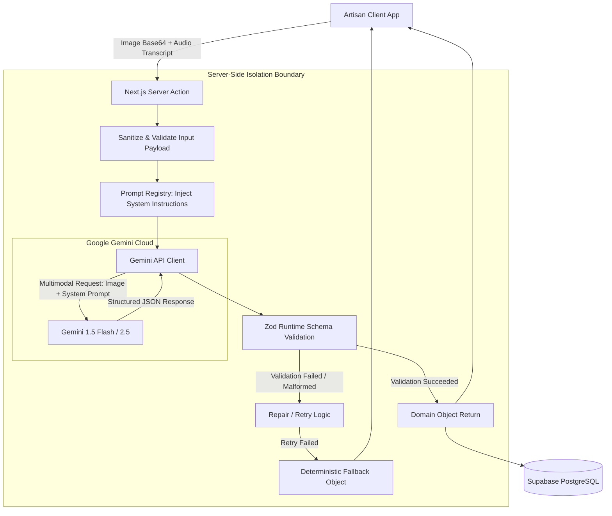

# KarigarAI — AI Service Architecture (AI_ARCHITECTURE.md)

## 1. Architectural Philosophy

The AI subsystem in KarigarAI is designed around five core engineering principles:

1. **Strict Server-Side Isolation:** The Google Gemini API key (`GEMINI_API_KEY`) is strictly confined to server-side Next.js Server Actions and Route Handlers. No client-side browser bundle ever imports or executes AI SDK methods directly.
2. **Schema-Enforced Outputs (Zero Prose Parsing):** We never parse arbitrary text strings or regular expressions from the AI. Every AI call requests `application/json` output and passes through rigorous **Zod** runtime schema validation.
3. **Epistemic Truthfulness (Facts vs Inferences):** The AI clearly separates what is physically visible in the image, what was stated by the artisan, and what is an inferred recommendation.
4. **Anti-Hallucination Guardrails:** The system is explicitly prompted and constrained from fabricating historical dates, false geographic indications (GI Tags), or unverified government certifications (e.g., Handloom Mark, Silk Mark) unless provided by the artisan.
5. **Deterministic Fallbacks:** If the AI service is unavailable, throttled, or returns invalid data, the system gracefully degrades to user-editable manual templates without blocking the artisan's progress.

---

## 2. AI Subsystem Pipeline



---

## 3. Gemini Model Selection & Parameters

| Task | Selected Model | Temperature | Response MIME Type | Rationale |
| :--- | :--- | :--- | :--- | :--- |
| **Multimodal Product Analysis** | `gemini-1.5-flash` | `0.2` | `application/json` | Low temperature ensures factual visual extraction; fast response (< 2.5s) for mobile networks. |
| **Bilingual Catalog Generation** | `gemini-1.5-flash` | `0.4` | `application/json` | Slight creativity for engaging e-commerce copy while preserving strict factual accuracy. |
| **Pricing Reasoning** | `gemini-1.5-flash` | `0.1` | `application/json` | Near-deterministic reasoning on economic margins and craft value markup. |
| **Heritage Craft Story** | `gemini-1.5-flash` | `0.5` | `application/json` | Warm, culturally resonant storytelling grounded strictly in artisan notes. |

---

## 4. Zod Schema Contracts

All AI responses are validated against strongly typed Zod schemas in `lib/ai/schemas/`.

### 4.1 Product Vision Analysis Schema (`lib/ai/schemas/product-analysis.ts`)
```typescript
import { z } from "zod";

export const ProductAnalysisSchema = z.object({
  detectedTitle: z.string().min(3).max(100),
  category: z.string().min(2).max(50),
  craftType: z.string().min(2).max(50),
  primaryMaterial: z.string().min(2).max(50),
  visualAttributes: z.array(z.string()).min(1).max(10),
  suggestedTags: z.array(z.string()).min(3).max(10),
  confidenceScores: z.object({
    categoryConfidence: z.number().min(0).max(1),
    materialConfidence: z.number().min(0).max(1),
    craftTypeConfidence: z.number().min(0).max(1),
  }),
});

export type ProductAnalysisResult = z.infer<typeof ProductAnalysisSchema>;
```

### 4.2 Bilingual Catalog Generation Schema (`lib/ai/schemas/catalog.ts`)
```typescript
import { z } from "zod";

export const CatalogGenerationSchema = z.object({
  titleEnglish: z.string().min(5).max(120),
  titleHindi: z.string().min(5).max(150),
  descriptionEnglish: z.string().min(20).max(1500),
  descriptionHindi: z.string().min(20).max(1500),
  tagsEnglish: z.array(z.string()).min(3).max(10),
  tagsHindi: z.array(z.string()).min(3).max(10),
  keyAttributes: z.array(
    z.object({
      attributeNameEn: z.string(),
      attributeNameHi: z.string(),
      attributeValueEn: z.string(),
      attributeValueHi: z.string(),
    })
  ).min(2).max(8),
});

export type CatalogGenerationResult = z.infer<typeof CatalogGenerationSchema>;
```

### 4.3 Pricing Reasoning Schema (`lib/ai/schemas/pricing.ts`)
```typescript
import { z } from "zod";

export const PricingReasoningSchema = z.object({
  suggestedMarkupPercent: z.number().min(10).max(150),
  suggestedMinPrice: z.number().positive(),
  suggestedMaxPrice: z.number().positive(),
  recommendedPrice: z.number().positive(),
  reasoningEnglish: z.string().min(10).max(500),
  reasoningHindi: z.string().min(10).max(500),
  basis: z.literal("cost_assisted_ai_estimate"),
});

export type PricingReasoningResult = z.infer<typeof PricingReasoningSchema>;
```

---

## 5. Resilience, Retries & Error Handling

1. **Timeout Control:** Every Gemini invocation uses an `AbortController` timeout capped at **8,000 milliseconds**.
2. **Schema Retry Protocol:** If Gemini returns a JSON object that fails Zod validation:
   - The error is captured.
   - A single repair pass is triggered or the system immediately returns a safe default fallback constructed from the user's raw inputs.
3. **Circuit Breaker:** If 3 consecutive AI calls fail within 60 seconds (due to quota or network drop), the system automatically enters **Manual Assist Mode**, directly presenting pre-populated editable text forms to the artisan.
