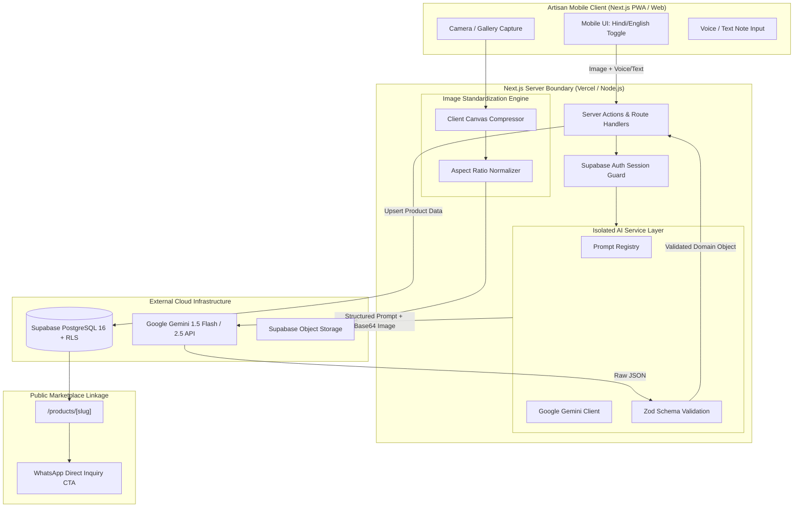
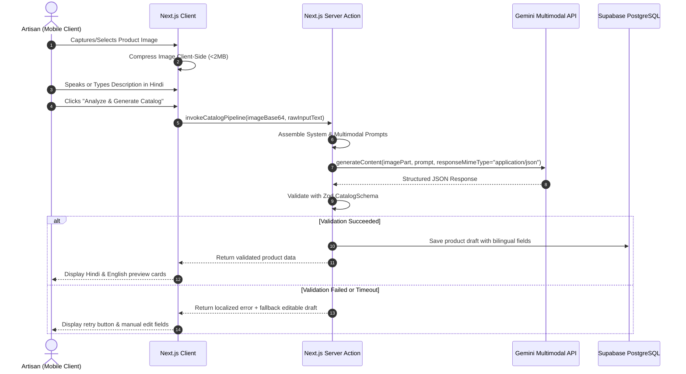
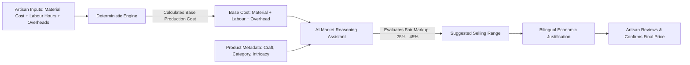

# KarigarAI — System Architecture (ARCHITECTURE.md)

## 1. High-Level Architecture Overview

KarigarAI is built on a modern, decoupled, mobile-first full-stack architecture utilizing **Next.js (App Router)** as the web application foundation, **Supabase** for managed database, authentication, and asset storage, and **Google Gemini Multimodal API** as an isolated backend intelligence layer.

---

## 2. Layered Separation of Concerns

### 2.1 Client Layer (Presentation & Interaction)
* **Framework:** Next.js 15 App Router with React 19 Client Components (`"use client"`) for interactive state and Server Components (`RSC`) for fast, SEO-friendly public pages.
* **Styling:** Tailwind CSS with custom design tokens representing traditional Indian terracotta/saffron tones paired with clean slate neutrals.
* **State Management:** Lightweight React state (`useState`, `useReducer`, `useTransition`) avoiding heavy Redux/Zustand libraries for an MVP.
* **Mobile Adaptability:** Touch targets $\ge 48\text{px}$, responsive viewport sizing (`w-full max-w-md mx-auto` on desktop to simulate mobile app experience).

### 2.2 Server Boundary & API Layer
* **Location:** Next.js Server Actions and Route Handlers under `/app/api/`.
* **Security Isolation:** All private environment variables (`GEMINI_API_KEY`, `SUPABASE_SERVICE_ROLE_KEY`) are strictly confined to the server environment. The browser never communicates with the Gemini API directly.
* **Session Verification:** Authenticated routes verify user identity via Supabase Auth before processing any product updates or database mutations.

### 2.3 AI Service Layer (`lib/ai/`)
The AI layer is completely isolated and decoupled from React components:
* `lib/ai/gemini.ts`: Unified client initialization, retry logic with exponential backoff, timeout handling, and model abstraction.
* `lib/ai/prompts/`: Versioned, immutable system prompts isolated into dedicated modules.
* `lib/ai/schemas/`: Zod runtime schemas that define the exact structure of expected AI outputs.
* **Pipeline Pattern:**
  $$\text{Request} \longrightarrow \text{Prompt Assembly} \longrightarrow \text{Gemini API} \longrightarrow \text{JSON Parse} \longrightarrow \text{Zod Parse} \longrightarrow \text{Safe Typed Result}$$

### 2.4 Data Persistence & Storage Layer (`supabase/`)
* **Database:** PostgreSQL 16 managed via Supabase.
* **Security:** Row Level Security (RLS) is enabled on all tables (`profiles`, `products`, `product_tags`, `craft_stories`).
* **Storage:** Public bucket `product-images` with RLS restricting write operations to authenticated product owners, while permitting public reads for published product images.

---

## 3. Detailed Data Pipelines

### 3.1 Product Onboarding & AI Cataloging Pipeline

### 3.2 Pricing Determination Pipeline

---

## 4. Key Architectural Decisions (Summary)

| Decision | Chosen Approach | Rationale | Alternatives Rejected |
| :--- | :--- | :--- | :--- |
| **Framework** | Next.js 15 (App Router) | Unified TypeScript full-stack, easy Vercel deployment, zero backend config. | Separate Express.js server + React SPA (unnecessary operational overhead for solo dev). |
| **BaaS & DB** | Supabase (Postgres 16) | Built-in Auth, Storage, Postgres RLS, instant setup, generous free tier. | Firebase (NoSQL schema chaos), Self-hosted PostgreSQL (DevOps overhead). |
| **AI Vision** | Google Gemini 1.5 Flash / 2.5 | Native multimodal input, fast response (<3s), JSON mode, cost-effective. | OpenAI GPT-4o (Higher latency & API cost), Open-source LLaVA (requires GPU hosting). |
| **Schema Validation**| Zod | End-to-end type safety from AI output to database and React components. | Joi / Yup (Weaker TypeScript type inference). |
| **Image Processing** | Client Canvas + Sharp fallback | Zero external server costs, immediate feedback, operates offline on device. | Cloudinary / Replicate (External API quotas, billing risk). |

---

## 5. Resilience & Fault-Tolerance Boundaries

1. **AI Service Outage:** If the Gemini API experiences rate limiting (`429`) or server outage (`503`), the UI immediately falls back to a clean manual input form prefilled with default values, ensuring the artisan is never blocked from saving a product.
2. **Slow Network / Offline Scenarios:** Form states are cached in browser `localStorage` or `sessionStorage` so unsubmitted drafts survive accidental page refreshes.
3. **Storage Fallback:** If Supabase Storage upload times out, the local base64 preview is preserved temporarily while showing an unobtrusive retry indicator.
