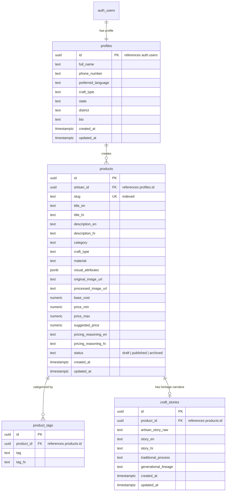

# KarigarAI — Database Architecture & Schema Specification (DATABASE.md)

## 1. Overview & Engine

KarigarAI utilizes **PostgreSQL 16** hosted on **Supabase**. The database leverages **Row Level Security (RLS)** to enforce strict multi-tenant data boundaries at the SQL engine level.

Key Design Principles:
1. **Normalized Structure:** Clear foreign key relationships without redundant duplication.
2. **Bilingual Columns:** Parallel fields for English (`_en`) and Hindi (`_hi`) to preserve full cultural and linguistic fidelity.
3. **Strict Audit Trails:** Automatic `created_at` and `updated_at` timestamps managed via PostgreSQL triggers.
4. **URL Safety:** Unique, sanitized slugs for SEO-friendly, human-readable public sharing (`/products/[slug]`).

---

## 2. Entity-Relationship Diagram



---

## 3. Data Dictionary

### 3.1 Table: `profiles`
Stores artisan identity and contact information.

| Column | Type | Constraints | Description |
| :--- | :--- | :--- | :--- |
| `id` | `UUID` | Primary Key, References `auth.users(id)` ON DELETE CASCADE | Matches Supabase Auth user ID. |
| `full_name` | `TEXT` | NOT NULL | Artisan's full name (e.g. Rameshwar Prajapati). |
| `phone_number` | `TEXT` | NULLABLE | Contact/WhatsApp phone number for buyer inquiries. |
| `preferred_language`| `TEXT` | DEFAULT `'hi'` (CHECK in `'hi', 'en'`) | Preferred UI and communication language. |
| `craft_type` | `TEXT` | NOT NULL | Primary craft (e.g., Terracotta, Handloom, Brass). |
| `state` | `TEXT` | NULLABLE | State of origin (e.g., Uttar Pradesh). |
| `district` | `TEXT` | NULLABLE | District / artisan cluster (e.g., Gorakhpur). |
| `bio` | `TEXT` | NULLABLE | Brief artisan summary. |
| `created_at` | `TIMESTAMPTZ`| DEFAULT `NOW()` | Profile creation timestamp. |
| `updated_at` | `TIMESTAMPTZ`| DEFAULT `NOW()` | Last profile update timestamp. |

---

### 3.2 Table: `products`
The core catalog table holding bilingual product details, imagery, and pricing.

| Column | Type | Constraints | Description |
| :--- | :--- | :--- | :--- |
| `id` | `UUID` | Primary Key, DEFAULT `gen_random_uuid()` | Unique product identifier. |
| `artisan_id` | `UUID` | NOT NULL, References `profiles(id)` ON DELETE CASCADE | Creator of the product. |
| `slug` | `TEXT` | NOT NULL, UNIQUE | URL slug (e.g., `terracotta-water-surahi-4921`). |
| `title_en` | `TEXT` | NOT NULL | Polished English product title. |
| `title_hi` | `TEXT` | NOT NULL | Polished Hindi product title. |
| `description_en` | `TEXT` | NOT NULL | Comprehensive English product description. |
| `description_hi` | `TEXT` | NOT NULL | Comprehensive Hindi product description. |
| `category` | `TEXT` | NOT NULL | Product category (e.g., Home Decor, Apparel). |
| `craft_type` | `TEXT` | NOT NULL | Traditional craft discipline. |
| `material` | `TEXT` | NOT NULL | Primary material used (e.g., Terracotta Clay, Silk). |
| `visual_attributes`| `JSONB`| DEFAULT `'[]'::jsonb` | Array of detected visual traits (colors, patterns). |
| `original_image_url`| `TEXT`| NOT NULL | URL to original photo captured by artisan. |
| `processed_image_url`| `TEXT`| NULLABLE | URL to standardized, processed studio image. |
| `base_cost` | `NUMERIC(10,2)`| DEFAULT 0.00 | Calculated base production cost (Materials + Labour + Overhead). |
| `price_min` | `NUMERIC(10,2)`| DEFAULT 0.00 | Minimum suggested fair retail price. |
| `price_max` | `NUMERIC(10,2)`| DEFAULT 0.00 | Maximum suggested fair retail price. |
| `suggested_price` | `NUMERIC(10,2)`| DEFAULT 0.00 | Recommended listing price. |
| `pricing_reasoning_en`| `TEXT`| NULLABLE | AI-assisted explanation of markup logic (English). |
| `pricing_reasoning_hi`| `TEXT`| NULLABLE | AI-assisted explanation of markup logic (Hindi). |
| `status` | `TEXT` | DEFAULT `'draft'` (CHECK in `'draft', 'published', 'archived'`) | Publication state. |
| `created_at` | `TIMESTAMPTZ`| DEFAULT `NOW()` | Created timestamp. |
| `updated_at` | `TIMESTAMPTZ`| DEFAULT `NOW()` | Updated timestamp. |

---

### 3.3 Table: `product_tags`
Stores normalized search and discoverability tags.

| Column | Type | Constraints | Description |
| :--- | :--- | :--- | :--- |
| `id` | `UUID` | Primary Key, DEFAULT `gen_random_uuid()` | Unique tag record ID. |
| `product_id` | `UUID` | NOT NULL, References `products(id)` ON DELETE CASCADE | Associated product. |
| `tag` | `TEXT` | NOT NULL | English / romanized search tag (e.g. `handmade-pottery`). |
| `tag_hi` | `TEXT` | NULLABLE | Devanagari Hindi search tag (e.g. `मिट्टीकेबर्तन`). |

---

### 3.4 Table: `craft_stories`
Stores authentic cultural, generational, and process narratives.

| Column | Type | Constraints | Description |
| :--- | :--- | :--- | :--- |
| `id` | `UUID` | Primary Key, DEFAULT `gen_random_uuid()` | Unique record ID. |
| `product_id` | `UUID` | NOT NULL, UNIQUE, References `products(id)` ON DELETE CASCADE | 1-to-1 relationship with product. |
| `artisan_story_raw` | `TEXT` | NULLABLE | Unfiltered oral/text note provided by artisan. |
| `story_en` | `TEXT` | NOT NULL | Formatted cultural narrative in English. |
| `story_hi` | `TEXT` | NOT NULL | Formatted cultural narrative in Hindi. |
| `traditional_process`| `TEXT` | NULLABLE | Explanation of traditional hand-making technique. |
| `generational_lineage`| `TEXT` | NULLABLE | Family/village lineage description (if supplied). |
| `created_at` | `TIMESTAMPTZ`| DEFAULT `NOW()` | Creation timestamp. |
| `updated_at` | `TIMESTAMPTZ`| DEFAULT `NOW()` | Update timestamp. |

---

## 4. Row Level Security (RLS) Policies

All tables have RLS enabled. Data privacy is strictly enforced:

### 4.1 Profiles Policy
```sql
ALTER TABLE profiles ENABLE ROW LEVEL SECURITY;

-- Anyone can read public artisan info
CREATE POLICY "Public profiles are viewable by everyone" 
ON profiles FOR SELECT USING (true);

-- Artisans can only insert/update their own profile
CREATE POLICY "Users can insert their own profile" 
ON profiles FOR INSERT WITH CHECK (auth.uid() = id);

CREATE POLICY "Users can update their own profile" 
ON profiles FOR UPDATE USING (auth.uid() = id);
```

### 4.2 Products Policy
```sql
ALTER TABLE products ENABLE ROW LEVEL SECURITY;

-- Anyone can view published products
CREATE POLICY "Published products are viewable by everyone" 
ON products FOR SELECT USING (status = 'published');

-- Artisans can view all their own products (including drafts & archived)
CREATE POLICY "Artisans can view their own products" 
ON products FOR SELECT USING (auth.uid() = artisan_id);

-- Artisans can insert/update/delete their own products
CREATE POLICY "Artisans can insert their own products" 
ON products FOR INSERT WITH CHECK (auth.uid() = artisan_id);

CREATE POLICY "Artisans can update their own products" 
ON products FOR UPDATE USING (auth.uid() = artisan_id);

CREATE POLICY "Artisans can delete their own products" 
ON products FOR DELETE USING (auth.uid() = artisan_id);
```

### 4.3 Storage Bucket Security (`product-images`)
* **Public Reads:** Public bucket access enabled so consumers can view images on public product pages.
* **Authenticated Writes:** Restrict upload/write operations strictly to authenticated artisans writing into their personal folder `product-images/{artisan_id}/*`.
